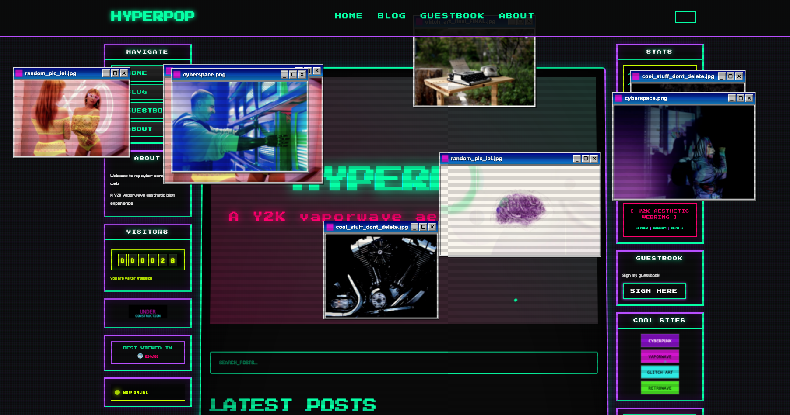

# HYPERPOP

[](https://app.netlify.com/sites/hyperpop-theme/deploys)
[](https://www.gnu.org/licenses/agpl-3.0)
[](https://www.11ty.dev/)
[](http://makeapullrequest.com)

> A Y2K-inspired static blog theme built with Eleventy. Features authentic late 90s/early 2000s web aesthetics with modern performance and accessibility.

**[Live Demo](https://hyperpop-theme.netlify.app)** | **[Documentation](#documentation)** | **[Getting Started](#quick-start)**



## Features

- **Y2K Aesthetics** - Neon colors, glitch effects, holographic borders, and CRT vibes
- **Lightning Fast** - Static site generation with optimized assets
- **Pure CSS Magic** - Scan lines, chromatic aberration, animated gradients
- **Interactive Elements** - Custom cursor trail, Konami code easter egg, client-side search
- **Fully Responsive** - Beautiful on all devices with touch optimization
- **Accessible** - WCAG AA compliant with reduced motion support
- **Client-Side Search** - Fast, privacy-respecting search with JSON index
- **Stats Counter** - localStorage-based page view tracking
- **Offline Support** - Service worker for offline capability
- **SEO Optimized** - Meta tags, sitemap, RSS feed

## Quick Start

### Prerequisites

- Node.js 14+ and npm

### Installation

```bash
# Clone the repository
git clone https://github.com/brennanbrown/hyperpop.git
cd hyperpop

# Install dependencies
npm install

# Start the development server
npm run dev
```

Visit `http://localhost:8080` to see your site!

### Build for Production

```bash
# Build the site
npm run build

# Output will be in _site/
```

## Project Structure

```
hyperpop/
├── src/
│   ├── _includes/
│   │   ├── layouts/          # Page layouts
│   │   │   ├── base.njk
│   │   │   ├── post.njk
│   │   │   └── page.njk
│   │   ├── components/       # Reusable components
│   │   │   ├── header.njk
│   │   │   ├── footer.njk
│   │   │   ├── post-card.njk
│   │   │   ├── glitch-text.njk
│   │   │   └── neon-button.njk
│   │   └── partials/         # Partial templates
│   │       ├── head.njk
│   │       └── scripts.njk
│   ├── _data/                # Global data files
│   │   ├── site.json
│   │   └── navigation.json
│   ├── assets/
│   │   ├── css/
│   │   │   └── styles.css    # Main stylesheet
│   │   └── js/
│   │       ├── main.js       # Core functionality
│   │       ├── cursor.js     # Cursor trail effect
│   │       ├── glitch.js     # Glitch animations
│   │       ├── konami.js     # Easter egg
│   │       ├── stats.js      # Stats counter
│   │       └── search.js     # Client-side search
│   ├── posts/                # Blog posts (Markdown)
│   ├── pages/                # Static pages
│   ├── index.njk             # Homepage
│   ├── feed.njk              # RSS feed
│   ├── search-index.njk      # Search index JSON
│   └── sw.js                 # Service worker
├── scripts/
│   └── generate-sitemap.js   # Sitemap generator
├── .eleventy.js              # Eleventy configuration
├── package.json
└── netlify.toml              # Netlify deployment config
```

## Customization

### Colors

Edit the CSS variables in `src/assets/css/styles.css`:

```css
:root {
  --neon-purple: #9D00FF;
  --hot-pink: #FF10F0;
  --cyber-blue: #00F0FF;
  --acid-green: #39FF14;
  /* ... more colors */
}
```

### Site Information

Update `src/_data/site.json`:

```json
{
  "title": "Your Site Name",
  "description": "Your description",
  "url": "https://yoursite.com",
  "author": "Your Name"
}
```

### Navigation

Modify `src/_data/navigation.json` to change menu items.

### Typography

The site uses Google Fonts by default:
- **Press Start 2P** - Pixel headers
- **VT323** - Monospace terminal
- **Space Mono** - Body text
- **Orbitron** - Futuristic accents

Change fonts in `src/_includes/partials/head.njk`.

## Creating Content

### New Blog Post

Create a new Markdown file in `src/posts/`:

```markdown
---
title: "Your Post Title"
date: 2025-10-11
tags: 
  - tag1
  - tag2
category: "category-name"
featured_image: "https://example.com/image.jpg"
excerpt: "Brief description"
color_scheme: "#FF10F0"
layout: "layouts/post.njk"
---

Your content here...
```

### New Page

Create a Markdown file in `src/pages/`:

```markdown
---
layout: layouts/page.njk
title: "Page Title"
permalink: /page-slug/
---

Page content...
```

## Easter Eggs

Try the **Konami Code** on the homepage:  
`↑ ↑ ↓ ↓ ← → ← → B A`

Unlocks ultra glitch mode!

## Deployment

### Netlify (Recommended)

1. Push to GitHub
2. Connect to Netlify
3. Build command: `npm run build`
4. Publish directory: `_site`

The `netlify.toml` is already configured!

### Other Platforms

The site works on any static hosting:
- Vercel
- GitHub Pages
- Cloudflare Pages
- Render

## Image Management

### Get Y2K Aesthetic Images

The project includes a custom image scraper for downloading vaporwave/cyberpunk images:

```bash
# Download Y2K aesthetic images
npm run scrape-images

# Copy images to site and update posts
npm run integrate-images
npm run update-images
```

**What it does:**
- Downloads images from Unsplash, Pexels, Pixabay
- Searches for: vaporwave, cyberpunk, glitch art, etc.
- Filters by your color palette (purple, pink, cyan)
- Saves photographer credits automatically
- Creates an HTML gallery to preview

**Preview images before using:**
```bash
open y2k_moodboard/gallery.html
```

### Setting Up API Keys

The image scraper uses free API keys from image providers. To set them up:

1. **Copy the example environment file:**
   ```bash
   cp .env.example .env
   ```

2. **Get free API keys from:**
   - **Pexels**: https://www.pexels.com/api/ (free, no credit card)
   - **Pixabay**: https://pixabay.com/api/docs/ (free, no credit card)

3. **Add your keys to `.env`:**
   ```bash
   PEXELS_API_KEY=your_pexels_key_here
   PIXABAY_API_KEY=your_pixabay_key_here
   ```

4. **Run the scraper:**
   ```bash
   npm run scrape-images
   ```

**Note:** The `.env` file is gitignored to keep your API keys private. Never commit API keys to git!

See `scripts/README.md` for detailed documentation.

## Development

### Available Scripts

- `npm run dev` - Start development server
- `npm run build` - Build for production
- `npm run debug` - Build with debug output
- `npm run clean` - Remove build output
- `npm run scrape-images` - Download Y2K aesthetic images
- `npm run integrate-images` - Copy images to site
- `npm run update-images` - Update posts with images

### Watch Mode

The dev server watches for changes:
- Templates (.njk, .md)
- CSS files
- JavaScript files

## Performance

The site is optimized for speed:

- Static HTML generation
- Critical CSS inlined
- Lazy loading images
- Service worker caching
- Minified assets (in production)
- WebP images with fallbacks

Target Lighthouse scores:
- Performance: 90+
- Accessibility: 100
- Best Practices: 90+
- SEO: 100

## Accessibility

Built with accessibility in mind:

- Semantic HTML
- ARIA labels where needed
- Keyboard navigation support
- `prefers-reduced-motion` support
- WCAG AA color contrast
- Screen reader friendly

## Contributing

Contributions are welcome! Whether it's:

- Bug fixes
- New features
- Documentation improvements
- Design enhancements

Please feel free to open an issue or submit a pull request.

### Development Guidelines

1. Fork the repository
2. Create a feature branch (`git checkout -b feature/amazing-feature`)
3. Commit your changes (`git commit -m 'Add amazing feature'`)
4. Push to the branch (`git push origin feature/amazing-feature`)
5. Open a Pull Request

## Credits

### Built With

- **[Eleventy](https://www.11ty.dev/)** - Static site generator
- **[Nunjucks](https://mozilla.github.io/nunjucks/)** - Templating
- **[Press Start 2P](https://fonts.google.com/specimen/Press+Start+2P)** & **[Jersey 10](https://fonts.google.com/specimen/Jersey+10)** - Google Fonts
- **[Pexels](https://www.pexels.com/)** & **[Pixabay](https://pixabay.com/)** - Free stock photos

### Inspiration

- Late 90s/early 2000s web design (GeoCities, Angelfire)
- Vaporwave and Y2K aesthetics
- Hyperpop and alternative internet culture
- Windows 98 UI design

## Support This Project

If you find this theme helpful, please consider supporting its development:

<div align="center">

[](https://ko-fi.com/brennan)
[](https://github.com/sponsors/brennanbrown)

</div>

Your support helps me:
- Maintain and improve this theme
- Create more open-source projects
- Write tutorials and documentation
- Stay caffeinated while coding

Even a small contribution makes a huge difference! Thank you!

## License

MIT License - feel free to use this theme for your own projects!

See the [LICENSE](LICENSE) file for details.

---

<div align="center">

**Made with love by [Brennan Brown](https://github.com/brennanbrown)**

If you found this project helpful, consider giving it a star!

[](https://github.com/brennanbrown/hyperpop)
[](https://twitter.com/brennankbrown)

*Built with love using 11ty and way too much neon.*

[Live Demo](https://hyperpop-theme.netlify.app) • [Report Bug](https://github.com/brennanbrown/hyperpop/issues) • [Request Feature](https://github.com/brennanbrown/hyperpop/issues)

</div>
